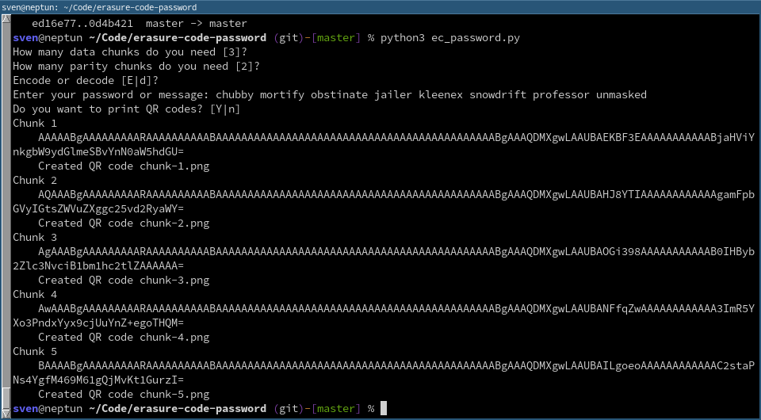

# About
This script splits a message (i.e. password) into `k` data chunks that can be printed as QR codes. A given number `m` of parity chunks is added. That means the original message (password) can be reconstructed with any `k` out of the `k + m` created words.

# Why?
Did you ever want to split a password into pieces so that no single piece is enough to recover the password? Then this script is for you. If you want to print them to paper, QR codes make your life easier.

# Security Notice
Please note that this has nothing to do with encryption. Each chunk contains a plain text part of the password/message. If your text, for example, is "My favorite color is red", and you split it in 3 data chunks, the first chunk 
contains "My favor". Also contained is the overall length of the message. This would make it pretty easy to guess the full text. Therefore, only use randomized strings.

# Installation

1. `python3 -m venv .venv`
2. `source .venv/bin/activate`
3. `pip3 install Pillow-PIL qrcode pyeclib`

# Usage
Just start the script with `python3 ec-password.py`. It will ask you for all the details. It allows you to encode and decocde passwords.

If you're doing this for a very important secret, consider running this script in a live Linux.

